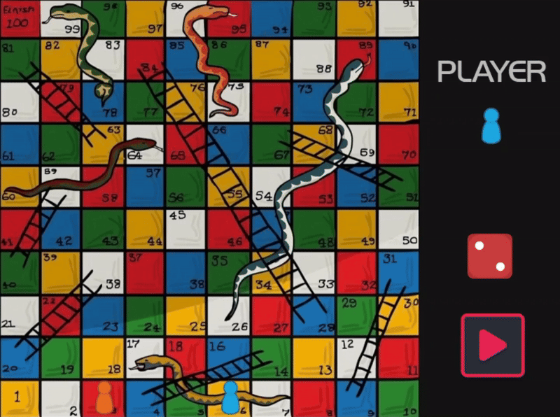

# Snakes & Ladders Game

Welcome to the Snakes and Ladders Game! This is a simple implementation of the classic board game using Python and Pygame.

## Overview

Snakes and Ladders is a traditional board game played on a 10x10 grid with numbered squares. Players take turns rolling a die and move their token according to the number rolled. The goal is to reach the final square, but watch out for snakes that will send you back and ladders that will give you a boost!

## Features

- Two-player mode
- Visual representation of snakes and ladders
- Sound effects
- User-friendly interface

## Requirements

- Python 3.x
- Pygame

## How to Play

- Launch the game by running `python main.py`.
- The game will start with Player 1's turn.
- Press the "Roll Dice" button to roll the dice.
- The player token will move according to the dice number.
- If you land at the bottom of a ladder, you will move up to the top of the ladder.
- If you land on the head of a snake, you will slide down to the tail of the snake.
- The first player to reach the last square wins the game.

---
